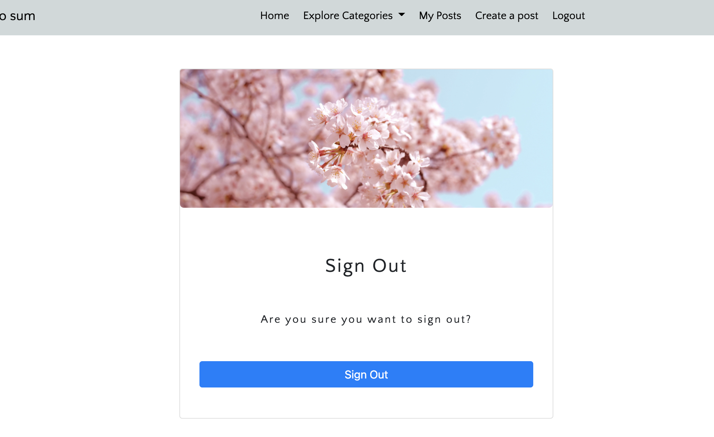
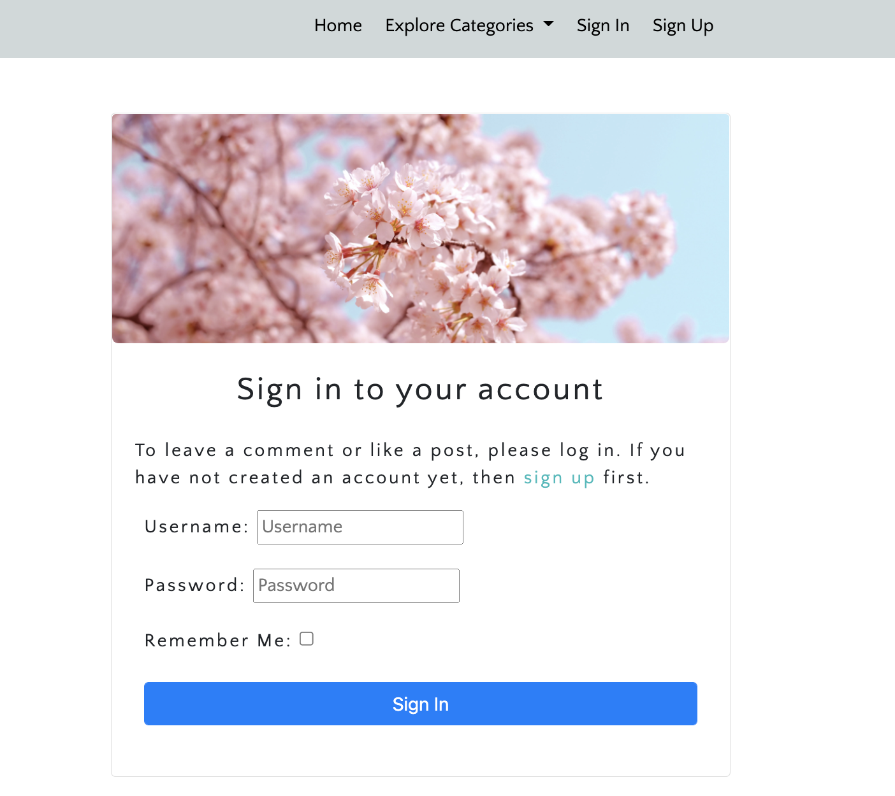
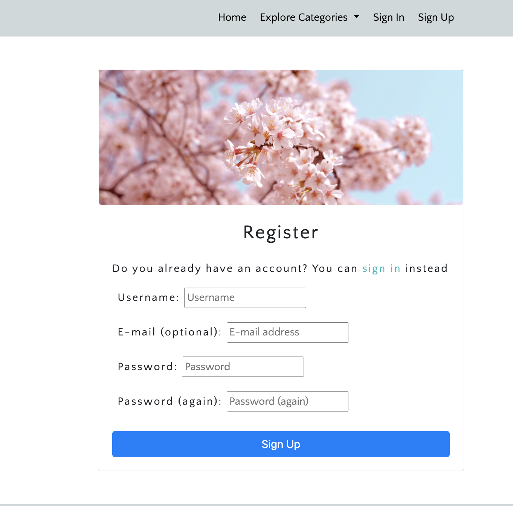
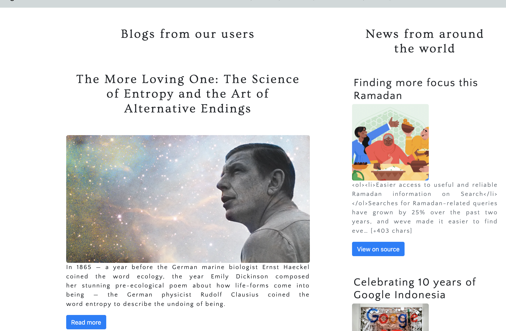
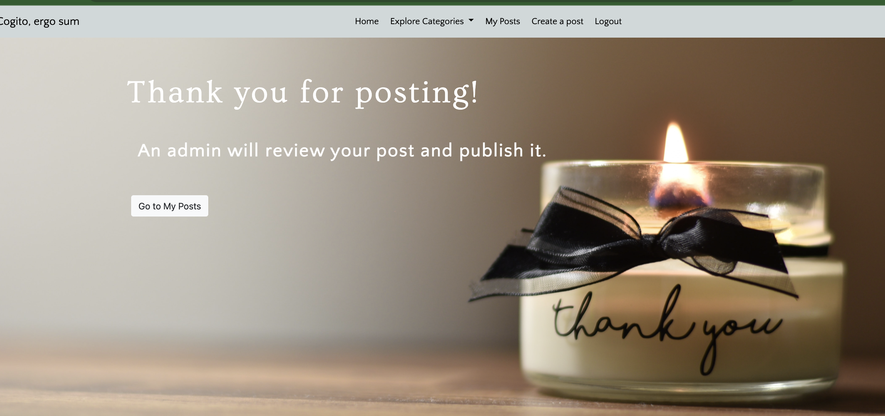
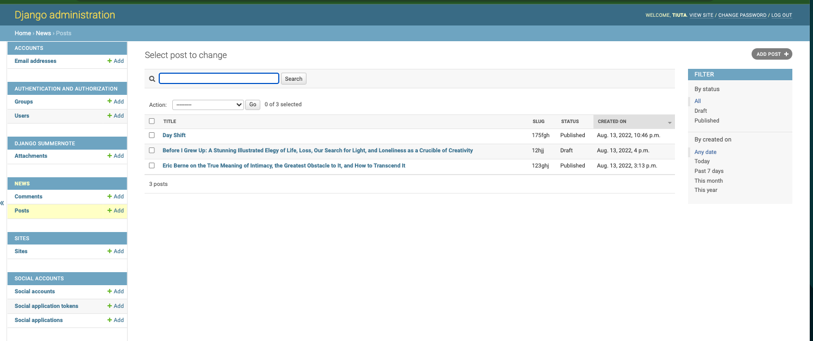
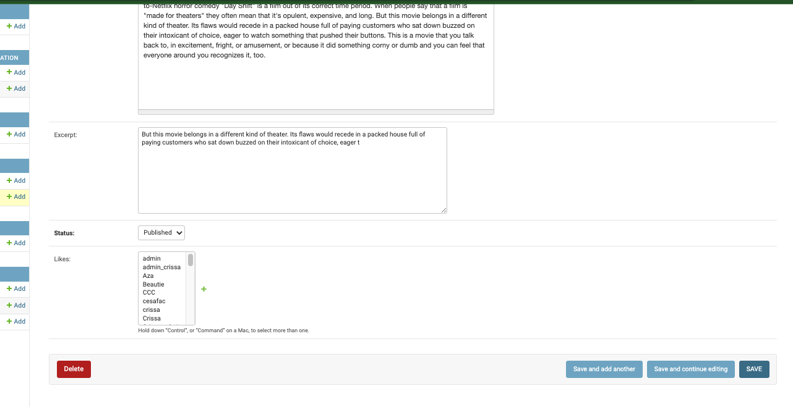
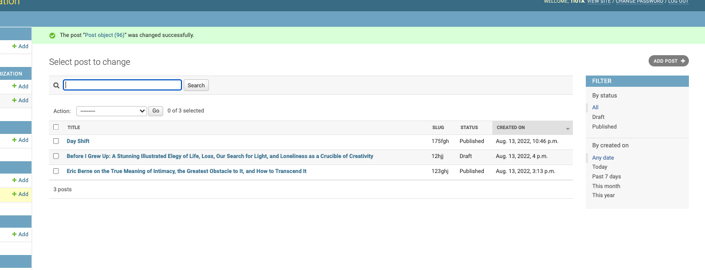
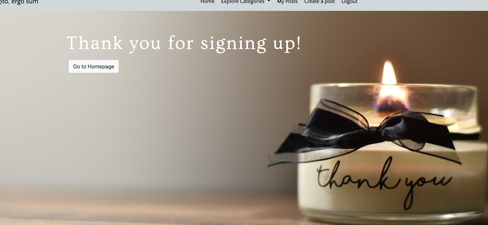

# **Cogito, ergo sum**


You can view the live website [here](https://cogito-news.herokuapp.com/).

 

## **About this project**
This is a full stack website build uinsg Django, Python, Postgres SQL, Bootstrap, Javascript, HTML and CSS.
This project allows users to sign up and login to the website, create their own posts and chose a categpry for their posts. Users are also able to read and like posts from other users. I've implemented a news API so that users can view news around the world based on 4 categories: Arts and Culture, Technology, Movies and Music and Travel. 
This website is for all those who are interested in the categories oulined above and who want to discover news from around the world at the same time as reading blogs written by users. 

## **UX design**
In building this website, I've followed the principles of UX design and implemented features that are responsive, are visually pleasing and overall create a good experience for the User.

## **User Stories**
The following User Stories have been used to organise and create this project

- **As a Site User I can like posts so that I can show my appreciation for the post** 
- **As a User I can easily navigate the website so that I can go from one page to another**
- **As a Site User I can click on View more to open a post so that I can read what's in it**
- **As a Site User I can sign up for an account so that I can like posts and create my own posts**
- **As a Site Admin I can update and delete posts so that I can moderate and website content**
- **As a Site Admin I can create drafts so that I can finish my writing later**
- **As a Site Admin I can create a Superuser so that I can manage posts and approve comments**
- **As a Site User I can view a list of posts that are available on the website so that I can select one to read**
- **As a Site User / Admin I can view the likes on each post so that I can see which are the most popular posts**
- **As a Site user / Site Admin I can select a category on the home page so that I can browse news from various sources**
- **As a Site User I can see the news from the world and click on View on Source to read the full story at its source**
- **As a **User** I can see that I'm signed in so that ** I can see my status on the website and log out from the website**
- **As a site user I receive a thank you page when I post a post so that I know my post was received and an admin is looking at the post**
-**As a site user I can access the posts I created under My posts, so I can read more, update and delete a post**

## Main Features and respective manual testing

I used the MVP model on my website. I have used a mix of Unitesting for the main features and manual testing for all features. 

- **Header image and Navigation Bar** 
Designed mainly using Bootstrap and CSS, the navbar is responsive on all devices, featuring a collapsible menu and a hamburger style menu on smaller devices like tablets and phones.
You can navigate from the navbar to all the main pages on the website. 
When User is not logged in, they will see options to Sign in and Register.


- **Header image and Navigation Bar - User is logged in** 
When User is logged in, they will see additional options to Create post, My posts and Log out. 


- **Sign in / Sign up / Logout**
When user wants to log, log out and sign up - user will see a responsive form to do so




- **Featured news and blogs**
User can access the 4 main categories from the home page


- **Write a post**
Users need to create an account that enables them to write posts


-**Write post call to action post on the Home page**


-**Categories and blogs page**
User can navigate to all categories from the categories page and User can read the blogs in a new page


-**Thanks message after posting**

User receices a message after posting 

-**View My posts**


-**Django admin panel**
Site Superuser can login to django and see all their posts and their statuses.


-**Django change post**
Site super User can read, delete and edit the posts from users 



-**Message after signing up**
After, signing up User is sent to a thank you page with a button that goes to the Home page.


## Design

I kept the design clean and elegant, tipography is Quattrocento Sans', fall back on Sans-Serif and Ovo with fallback on Serif.

## Testing

### Validator testing 
### HTML 


-
For the main text, 'Montserrat' font is used with a fall-back on sans-serif. For headings, navigation bar and footer, 'Arima Madurai' font is used with a fallback on cursive.

## **Technologies**
#### **Languages Used**
- [HTML](https://en.wikipedia.org/wiki/HTML5) 
- [CSS](https://en.wikipedia.org/wiki/CSS)
#### **Frameworks, Libraries & Programs Used**

1. [Google Fonts](https://fonts.google.com/) was used to import fonts 'Montserrat'and 'Arima Madurai' that are used throughout the website. 

2. [Adobe color](https://color.adobe.com/mythemes) was used to extract the colors used on the website. 
3. [Git](https://git-scm.com/) was used to used to edit the code on the Gitpod terminal, to commit to Git and Push to GitHub.

4. [GitHub](https://github.com/) is used to store the project code after being pushed from Git. 

## **Testing**
### **Validator Testing**

#### HTML code validator 
The website passed all code validations


#### CSS code validator


#### Lighthouse report
The website passed the Lighthouse report for all pages


### **Responsiveness Test**
- I used media queries to make my website responsive and can confirm that the website is responsive on all the screen sizes and devices I used as well as various browsers as listed below. 

### **Browser compatibility**
- I tested my website on various browsers and screen sizes as shown below. The website works well and is responsive on monitors and laptop screens. 
- I also tested the website using Chrome dev tools device toolbar, by adjusting the size of the window and by selecting the pre-set devices available there. 
- All links are clickable and open in a new tab. 
- Pictures resize accurately and are clear, nor blurry or pixelated. 

#### Browsers
- Chrome
- Microsoft Edge 
- Internet Explorer
- Mozilla Firefox
- Safari

#### Devices:
- Desktop
- Laptop
- Samsung S10 Plus
- Huawei P30
- iPhone 8
- iPhone XS
- Samsung tablet
- Lenovo tablet

### **Bugs** 
#### **Known Bug - header image on home page not displayed on tablet**
- I manually tested this on a Lenovo tablet and a Samsung one, the header image on the Home page is not displaying. I cannot see this issue in Chrome in Dev tools, therefore at the moment I don't have a way to find a fix for this. 

#### **Hebrew letters issue**
- When trying to validate my HTML code with W3C, Hebrew letters were not recognized as I was using vowels with them.
 - I added attribute lang="he to the heading as per this [W3.org article](https://www.w3.org/International/questions/qa-html-language-declarations)

- It didn't help fix the issue. I removed the vowels and it worked. There are limitations with adding several languages in the same code, there are a few options available out there but I didn't find viable solutions. 

#### **Browser is adding white margins on the sides** 
- This is a known bug for many browsers
- I searched online and found this [Stack Overflow article](https://stackoverflow.com/questions/4612307/website-has-strange-whitespace-on-right-side-of-the-page-when-the-browser-is-res) that is taken from [Wernull blog](https://blog.wernull.com/2013/04/debug-ghost-css-elements-causing-unwanted-scrolling/)

- I applied the troubleshoorung steps:
  1. Implement the code at the end of the CSS file
  ```css
  * {
    background: #000 !important;
    color: #0f0 !important;
    outline: solid #f00 1px !important;
  }
  ```
  2. Go to the website and refresh.
  3. Notice the white spaces on the margin - open inspect.
  4. The rule set by user agent style sheet sets margin to 8px.
  5. Notice I cannot test and change the margin on dev tools.
  6. Search online and find out that this refers to the default styles that browsers apply to web pages.
  7. Go to CSS files and remove code from step 1.
  8. Add margin and set it to 0.
  9. Refresh website and notice it fixed the issue - margin is not showing anymore. 
#### **Hover border**
  I removed the navigation bar hover border on screens smaller than 535px as it didn't fit the smaller screens. 

## **Deployment**
### GitHub Pages
The project was deployed to GitHub Pages using the following steps:
1. Go to GitHub and locate the repository to be deployed [GitHub Repository](https://github.com/Shoshie-coding/project-1)
2. On the top right-hand side - click Settings
3. Scroll down until you locate the Pages tab on the left-hand side navigation menu. 
4. Under Source - click on the drop-down called None and select Main and leave the /(root) option as it is. 
5. Click Save 
6.  The Page refreshes itself - message " Your site is ready to be published at https://shoshie-coding.github.io/project-1/. 
7. Refresh page - notice message -  Your site is published at https://shoshie-coding.github.io/project-1/. 

### Clone a repository using these steps:
1. On GitHub, navigate to the main page of the repository.

2. Above the list of files, click the Code button.
3. To clone the repository using HTTPS, under "Clone with HTTPS", click the clone symbol. To clone the repository using an SSH key, including a certificate issued by your organization's SSH certificate authority, click Use SSH, then click the clone symbol next to it. To clone a repository using GitHub CLI, click Use GitHub CLI, then click the same clone symbol .
4. Open Git Bash and change the current working directory to the location where you want the cloned directory.

5. Type git clone, and then paste the URL you copied earlier.

6. You will see a message confirmation that the command was successul. 


## **Credits**

### **Content**
The following resources were used as sources of information and inspiration for the content on my website:

- [Hebrew-English and English-Hebrew dictionary](https://www.morfix.co.il/en/) - this online dictionary was used mainly to translate words and to add them in Hebrew letters. 

- [Hebrew Language - Wikipedia article](https://en.wikipedia.org/wiki/Hebrew_language) - this article contains info on the Hebrew language and history. 

- [Encyclopaedia Britannica](https://www.britannica.com/topic/Hebrew-language) - this offers a short intro to the Hebrew language.

- [The Times of Israel article](https://blogs.timesofisrael.com/basic-hebrew-phrases-and-slang-you-should-know-in-israel/) with info on Israeli slang words. 

### **Media**
Some pictures on my website are not from royalty free websites. This is a student website, my project is for educational purposes only. If I decide to make this a commercial website, I will change the pictures. The pictures are listed below in order of appearance on the website.

- [Header image on Home page - free download from Unspash](https://unsplash.com/photos/xUXGHzhIbN4)

- Image of a Dead Sea Scrolls manuscript - [Lingualift](https://www.lingualift.com/blog/how-to-learn-hebrew-alphabet/) credited to [Facsimile finder](https://www.facsimilefinder.com/)

- [Lingualift](https://www.lingualift.com/blog/how-to-learn-hebrew-alphabet/) - Image of a medieval decorated text credited to [ [The Jewish Museum] (https://thejewishmuseum.org/)
- [Picture of Hebrew vowels](https://omniglot.com/writing/hebrew.htm) 

- [Yeshiva University Museum](https://www.yumuseum.org/programs/2019/09/08/art-workshop-new-years-cards-in-the-style-of-illuminated-hebrew-manuscripts) - picture with the word 'Shalom' in Hebrew. 

- Picture of a Hebrew text - free download from [Unsplash](https://unsplash.com/photos/eQ2Z9ay9Wws)

### **Code**
- Inspiration for the table on the Alphabet page came from [W3 Schools article](https://www.w3schools.com/css/css_table_style.asp)

- [W3 Schools article on pseudo-classes and link styling](https://www.w3schools.com/css/css_pseudo_classes.asp).

- [Article on how to design tables per per UX design rules](https://www.uxmatters.com/mt/archives/2020/07/designing-mobile-tables.php)

## Acknowledgements
My mentor for feedback and guiding me throughout the process and everyone at Code Institute who provided helpful tips along the way.  


Welcome Cristina Onea,

This is the Code Institute student template for Gitpod. We have preinstalled all of the tools you need to get started. It's perfectly ok to use this template as the basis for your project submissions.

You can safely delete this README.md file, or change it for your own project. Please do read it at least once, though! It contains some important information about Gitpod and the extensions we use. Some of this information has been updated since the video content was created. The last update to this file was: **September 1, 2021**

## Gitpod Reminders

To run a frontend (HTML, CSS, Javascript only) application in Gitpod, in the terminal, type:

`python3 -m http.server`

A blue button should appear to click: _Make Public_,

Another blue button should appear to click: _Open Browser_.

To run a backend Python file, type `python3 app.py`, if your Python file is named `app.py` of course.

A blue button should appear to click: _Make Public_,

Another blue button should appear to click: _Open Browser_.

In Gitpod you have superuser security privileges by default. Therefore you do not need to use the `sudo` (superuser do) command in the bash terminal in any of the lessons.

To log into the Heroku toolbelt CLI:

1. Log in to your Heroku account and go to *Account Settings* in the menu under your avatar.
2. Scroll down to the *API Key* and click *Reveal*
3. Copy the key
4. In Gitpod, from the terminal, run `heroku_config`
5. Paste in your API key when asked

You can now use the `heroku` CLI program - try running `heroku apps` to confirm it works. This API key is unique and private to you so do not share it. If you accidentally make it public then you can create a new one with _Regenerate API Key_.

------

## Release History

We continually tweak and adjust this template to help give you the best experience. Here is the version history:

**September 1 2021:** Remove `PGHOSTADDR` environment variable.

**July 19 2021:** Remove `font_fix` script now that the terminal font issue is fixed.

**July 2 2021:** Remove extensions that are not available in Open VSX.

**June 30 2021:** Combined the P4 and P5 templates into one file, added the uptime script. See the FAQ at the end of this file.

**June 10 2021:** Added: `font_fix` script and alias to fix the Terminal font issue

**May 10 2021:** Added `heroku_config` script to allow Heroku API key to be stored as an environment variable.

**April 7 2021:** Upgraded the template for VS Code instead of Theia.

**October 21 2020:** Versions of the HTMLHint, Prettier, Bootstrap4 CDN and Auto Close extensions updated. The Python extension needs to stay the same version for now.

**October 08 2020:** Additional large Gitpod files (`core.mongo*` and `core.python*`) are now hidden in the Explorer, and have been added to the `.gitignore` by default.

**September 22 2020:** Gitpod occasionally creates large `core.Microsoft` files. These are now hidden in the Explorer. A `.gitignore` file has been created to make sure these files will not be committed, along with other common files.

**April 16 2020:** The template now automatically installs MySQL instead of relying on the Gitpod MySQL image. The message about a Python linter not being installed has been dealt with, and the set-up files are now hidden in the Gitpod file explorer.

**April 13 2020:** Added the _Prettier_ code beautifier extension instead of the code formatter built-in to Gitpod.

**February 2020:** The initialisation files now _do not_ auto-delete. They will remain in your project. You can safely ignore them. They just make sure that your workspace is configured correctly each time you open it. It will also prevent the Gitpod configuration popup from appearing.

**December 2019:** Added Eventyret's Bootstrap 4 extension. Type `!bscdn` in a HTML file to add the Bootstrap boilerplate. Check out the <a href="https://github.com/Eventyret/vscode-bcdn" target="_blank">README.md file at the official repo</a> for more options.

------

## FAQ about the uptime script

**Why have you added this script?**

It will help us to calculate how many running workspaces there are at any one time, which greatly helps us with cost and capacity planning. It will help us decide on the future direction of our cloud-based IDE strategy.

**How will this affect me?**

For everyday usage of Gitpod, it doesn’t have any effect at all. The script only captures the following data:

- An ID that is randomly generated each time the workspace is started.
- The current date and time
- The workspace status of “started” or “running”, which is sent every 5 minutes.

It is not possible for us or anyone else to trace the random ID back to an individual, and no personal data is being captured. It will not slow down the workspace or affect your work.

**So….?**

We want to tell you this so that we are being completely transparent about the data we collect and what we do with it.

**Can I opt out?**

Yes, you can. Since no personally identifiable information is being captured, we'd appreciate it if you let the script run; however if you are unhappy with the idea, simply run the following commands from the terminal window after creating the workspace, and this will remove the uptime script:

```
pkill uptime.sh
rm .vscode/uptime.sh
```

**Anything more?**

Yes! We'd strongly encourage you to look at the source code of the `uptime.sh` file so that you know what it's doing. As future software developers, it will be great practice to see how these shell scripts work.

---

Happy coding!
